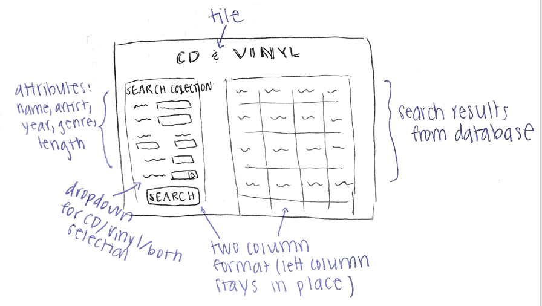

# Project 2, Milestone 1 - Design & Plan

Your Name:

## 1. Persona

I've selected **Abby** as my persona.

I chose Abby as my persona because she differs in behavior from me in most of the aspects we've studied (self-efficacy, information processing, etc.). This difference in attitude/learning will hold me accountable to create a website that is friendly for all users.

## 2.Describe your Catalog

My catalog is going to be a 'Vinyl and CD Collection' (say I'm selling my whole collection so users can browse the selection). The attributes I want to have are: album name, artist, year released, genre, type (cd or vinyl), and length (number of tracks).

If possible, if I have extra time I hope to include an attribute that holds all the track listings so you can find the album that holds a particular song.


## 3. Sketch & Wireframe

Sketch:


Wireframe:


My design would work for Abby, who has low self-efficacy, because it is pretty simple to navigate and a user can see right away how to search my database. Also, I hope to have a two column layout with the search column in place (even when you scroll the page) so that my user never really leaves where they started.

## 4. Database Schema Design

Table: cd_vinyl
* field 1: the album name
* field 2: the artist name (I want to have multiple albums by the same artist)
* field 3: the year the album was released
* field 4: the genre of the album's music
* field 5: the length / number of tracks on the cd/vinyl
* filed 6: the type (I either have it on CD or on Vinyl)

## 5. Database Query Plan

Pseudocode:

1. All records:

```
if all fields have no input (null):
  query the database
  return a table with our records
```
2. Search records by user selected field

```
create the prefix of our $sql parameter:  
  "SELECT * FROM cd_vinyl WHERE"...

for each user selected field:
  filter our records
  add constraint to our $sql string
  query the database
```

3. Insert record

```
if our query returned results:
  output the table of results

else:
  don't output anything
```

## 6. *Filter Input, Escape Output* Plan

For each of my fields (that had a user input/selection) I am going to loop through (with a for-each loop) and add a constraint to my string $sql.
For example, if the user only searched for a "Rock" cd's then I would concatenate to $sql:

```
 $sql = $sql . "genre=" . ' . $genre . ';
 $params= array();
 $query = $db->prepare($sql);
 ... and so on
```

As needed, I will escape values using the :var syntax.

## 7. Additional Code Planning
